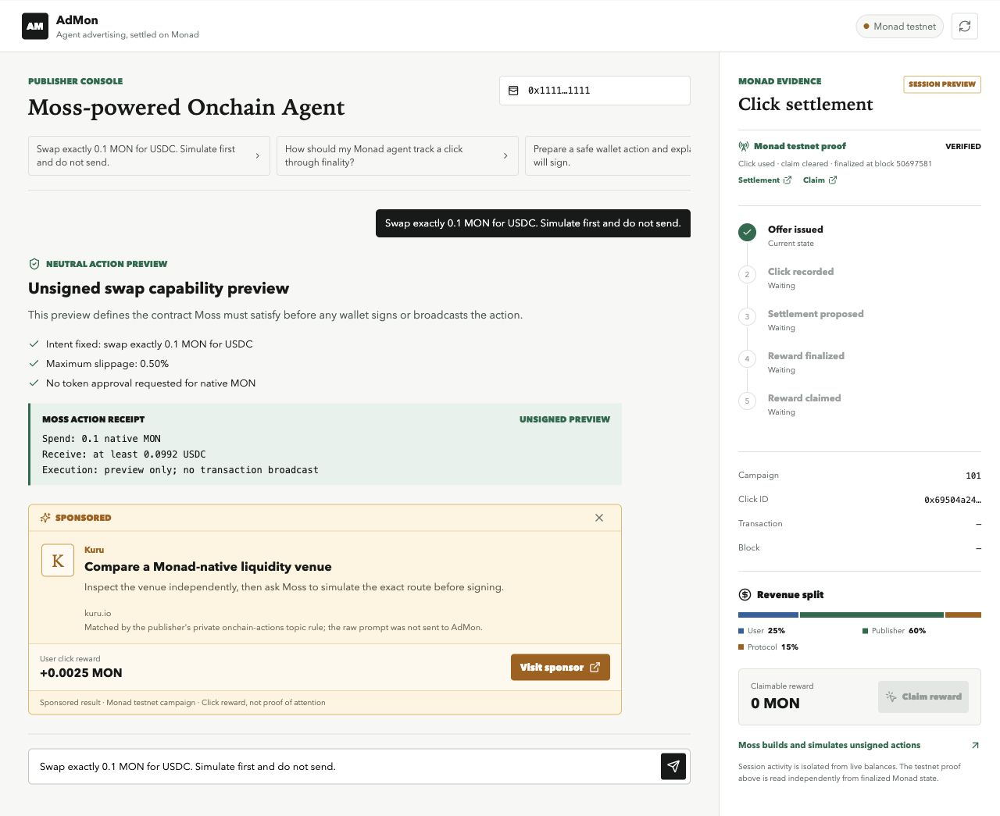

# AdMon

AdMon is an advertising and click-settlement layer for existing AI agent applications on Monad: AdSense for agent publishers, with transparent cards and MON revenue sharing.

An agent publisher integrates the AdMon decision API and card renderer into a useful application; end users install nothing. A user click creates a one-time receipt, and the Monad contract records a reward credit that the user can later withdraw as MON.

The current AdMon release focuses on fixed-price campaigns and verified click receipts. Onchain auctions, arbitrary host rendering, and advanced traffic-quality controls remain separate product tracks.



- Product requirements: [docs/PRD.md](docs/PRD.md)
- Product walkthrough: [docs/WALKTHROUGH.md](docs/WALKTHROUGH.md)

## Capabilities

- Native-MON settlement contract with 16 campaign shards and O(1) click settlement.
- User 25%, publisher 60%, and protocol 15% pull-based revenue sharing.
- Contract replay, expiry, relayer, budget, withdrawal, and claim tests.
- Publisher application with a separate `AdMonCard`, private topic routing, and one-time redirect.
- Portable stdio MCP server for Codex with structured output and Markdown fallback.
- Moss Protocol adapter for `claimable(account)` and one unsigned `claim()` Capability with a verified Receipt parser.

## Run locally

```bash
npm install
npm test
npm run build
npm run dev --workspace web
```

Open `http://localhost:3000`. The reference publisher host calls the same MCP offer tool used by external agent hosts. With a configured relayer, each signed click is submitted to the Monad testnet contract; without one, the UI keeps the activity explicitly marked as a session preview and never presents it as claimable MON.

Run the local contract verification:

```bash
npm run probe:local --workspace contracts
```

## Codex MCP

Build the MCP server, keep the web API running, and open this repository in a host that reads `.mcp.json`:

```bash
npm run build --workspace mcp-server
npm run dev --workspace web
```

The standalone host receives `get_ad_offer` and `get_click_status`. Tool invocation and custom visual card rendering remain host-controlled; the MCP always includes a Markdown fallback. The web publisher includes an in-memory MCP client/server pair so the reference page exercises the same structured tool boundary.

### Runtime settlement configuration

The relayer signs settlement transactions from an encrypted keystore. Keep the
keystore outside the repository and set these values in `web/.env.local`:

```bash
ADMON_RELAYER_KEYSTORE_PATH=/absolute/path/to/keystore-file
ADMON_RELAYER_KEYSTORE_PASSWORD=
ADMON_CHAIN_SETTLEMENT_REQUIRED=true
```

`ADMON_CHAIN_SETTLEMENT_REQUIRED=true` makes a click fail closed when the relayer
is unavailable or the campaign cannot be settled. The claim action is always
signed by the user's connected wallet on Monad testnet; AdMon never receives that
private key.

## Network deployment

AdMon is deployed on Monad testnet (`chainId 10143`) at [`0xA423ce5FE84554217554Af834C921269c1aaef38`](https://testnet.monadvision.com/address/0xA423ce5FE84554217554Af834C921269c1aaef38). The successful Safe execution transaction is [`0xa45be5f4...640e06`](https://testnet.monadvision.com/tx/0xa45be5f472adea00e2f59d00d24450a55cdcbc2ecb03155dc53460a6e0640e06), mined in block `50533513`.

The contract owner and protocol treasury are the 2-of-3 Safe at `0x719d34102D3c79C588f6C4BA3147cF10d00E4371`; the active relayer is `0x52d1C1b8BE94150B282276c493C21E20017E38Cb`. The Safe relayer update is [`0xa930ec12...cacc52`](https://testnet.monadscan.com/tx/0xa930ec126af82eabd95a4f7aa4c83ec2b460a227da276ec4663f21e438cacc52). These values and the deployed bytecode have been read back from the testnet RPC. The source is verified with a perfect match on MonadVision and is also verified on Monadscan.

Campaign creation [`0x0aa98d22...4d42cb`](https://testnet.monadscan.com/tx/0x0aa98d220fdbb1c883f3314e30e826fab5f226b8b8d51b818d24baa0094d42cb), click settlement [`0x0ad357b8...25805a`](https://testnet.monadscan.com/tx/0x0ad357b8a27c0797eb2768050dc4d1c0bddb3678e2f919b09fe0145c3425805a), and user claim [`0x15cd6072...f7c146`](https://testnet.monadscan.com/tx/0x15cd6072eefb56a40aaf4986f08b1eafb6c0bbc1a711d1498188550213f7c146) are finalized. Replaying the same click ID through `eth_call` reverts with `ClickAlreadyUsed(bytes32)`. The application independently reads those receipts, `usedClick`, the cleared claimable balance, and Monad's `finalized` block tag. Resettable session activity stays isolated from live balances.

Moss itself currently targets Monad mainnet, so the adapter is validated against the current Moss Capability/Receipt API offline; live Moss simulation waits for a compatible mainnet deployment.

The repository has also been verified from a clean copy without `node_modules`, `dist`, `.next`, contract cache, or artifacts using `npm ci && npm run build`. Root scripts build the vendored current Moss core before the AdMon adapter, so a fresh clone does not depend on generated declarations left on the developer machine.
